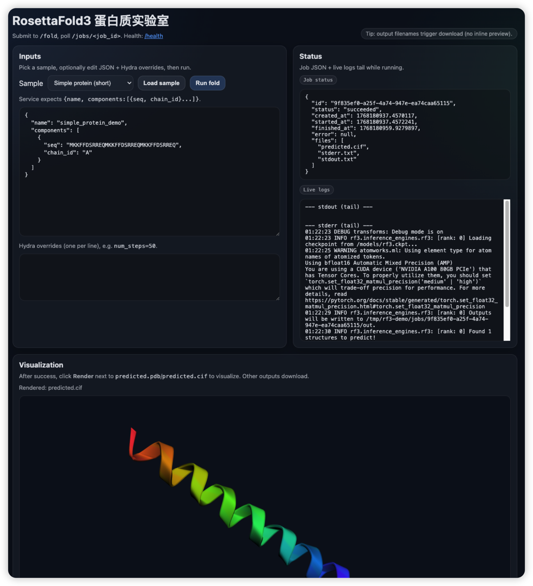
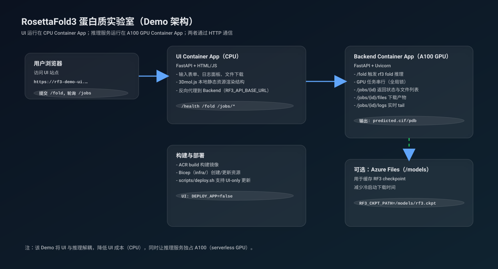

# RosettaFold3 (RF3) 蛋白质实验室（Azure Container Apps / A100）

本仓库将 RosettaFold3（RF3）推理能力封装成一个轻量的 HTTP API，并提供一个可直接体验的 Web Demo（UI 与模型推理分离部署）：

- 模型推理服务：Azure Container Apps **serverless A100 GPU**
- Web Demo（UI）：Azure Container Apps **普通 CPU**

在线体验（UI）：https://rf3-demo-ui.bluepebble-ef8ac46c.swedencentral.azurecontainerapps.io/

## RosettaFold3 简介

RosettaFold3（RF3）是一种**全原子（all-atom）生物大分子结构预测网络**，可用于根据输入的氨基酸序列（以及可选的多链/复合物信息）预测三维结构；其整体效果可与主流开源模型相竞争。

RF3 在训练阶段引入了额外的特征与约束（例如**隐式手性表示**、以及**原子级几何条件（atom-level geometric conditioning）**），从而在一些任务上表现更好，例如：

- **手性配体（chiral ligands）**的结构/构象预测
- **固定主链（fixed-backbone）**或**固定构象（fixed-conformer）**条件下的对接（docking）

本 Demo 通过上游 `rf3 fold` CLI（支持 Hydra 风格 `key=value` overrides）调用 RF3 完成推理，并提供 Web 端提交/查看/下载与结构可视化。

更多信息请参考预印本（preprint）：

- *Accelerating Biomolecular Modeling with AtomWorks and RF3* — https://doi.org/10.1101/2025.08.14.670328

> 输出结构通常以 `predicted.cif`（mmCIF）或 `predicted.pdb`（PDB）形式提供：它们是“结构坐标数据文件”，不是图片。

## 适用场景（示例）

- 结构生物学：快速获得候选结构用于后续分析/对比
- 蛋白工程与设计：评估突变对结构的潜在影响（研究用途）
- 药物发现：为结合口袋分析、对接等提供结构参考（研究用途）
- 教学/演示：通过 Web 页面提交序列、查看日志与结构可视化

## Demo 介绍

这个 Demo 提供：

- 提交折叠任务（`/fold`）并轮询查看状态（`/jobs/{id}`）
- 运行中实时查看日志 tail（`/jobs/{id}/logs`）
- 下载产物（`/jobs/{id}/files/{filename}`），并在网页内渲染 `predicted.cif/pdb`
- UI 内置 3Dmol.js（不依赖外部 CDN），适合网络受限环境

截图：



### 架构说明

- **Backend（GPU）**：运行 FastAPI + `rf3 fold`，串行执行 GPU 任务，提供作业与文件 API。
- **UI（CPU）**：轻量 FastAPI 页面 + 反向代理到 Backend；包含结构可视化、日志展示、文件下载。

架构图：



> 说明：当前作业元数据保存在内存中，部署/重启后旧的 `job_id` 不再可访问。

## API

- `GET /health` -> health check
- `POST /fold` -> submit a job
- `GET /jobs/{job_id}` -> check status and list output files
- `GET /jobs/{job_id}/files/{filename}` -> download an output artifact

### 输出文件说明（常见）

- `predicted.cif`：mmCIF 格式的结构坐标数据（推荐；更现代）
- `predicted.pdb`：PDB 格式的结构坐标数据（兼容性好）
- `stdout.txt` / `stderr.txt`：推理过程日志与诊断信息（便于排查问题）

### Example request

```bash
curl -sS -X POST "http://localhost:8080/fold" \
  -H 'content-type: application/json' \
  -d @- <<'JSON'
{
  "inputs": {
    "name": "simple_protein_demo",
    "components": [
      {"seq": "MKKFFDSRREQMKKFFDSRREQMKKFFDSRREQ", "chain_id": "A"}
    ]
  },
  "overrides": ["num_steps=50", "diffusion_batch_size=1"]
}
JSON
```

Then poll:

```bash
curl -sS "http://localhost:8080/jobs/<job_id>" | jq
```

### 通过在线 UI 使用（推荐）

1. 打开在线 Demo： https://rf3-demo-ui.bluepebble-ef8ac46c.swedencentral.azurecontainerapps.io/
2. 选择 Sample 或粘贴自己的输入 JSON（包含 `name` 与 `components:[{seq, chain_id}]`）
3. 点击 **Run fold** 提交任务
4. 运行中查看 **Live logs**；完成后在 **Outputs** 中下载文件或点击 **Render** 渲染结构

## Model checkpoint

By default the container downloads the **Latest** RF3 checkpoint at startup:

- `http://files.ipd.uw.edu/pub/rf3/rf3_foundry_01_24_latest.ckpt`

It is cached at `RF3_CKPT_PATH` (default `/models/rf3.ckpt`). In Azure Container Apps you should mount an Azure Files share at `/models` to avoid re-downloading on cold start.

## Local run (no GPU)

You can build the image locally (inference may fail without GPU):

```bash
docker build -t rf3-demo:local .

docker run --rm -p 8080:8080 -e RF3_CKPT_PATH=/models/rf3.ckpt rf3-demo:local
```

## Azure deployment

See `infra/` for Bicep IaC and `scripts/deploy.sh` for a CLI-based deployment flow.

> Note: Serverless GPUs require **quota** (Managed Environment Consumption NCA100 GPUs) and are only available in certain regions.
